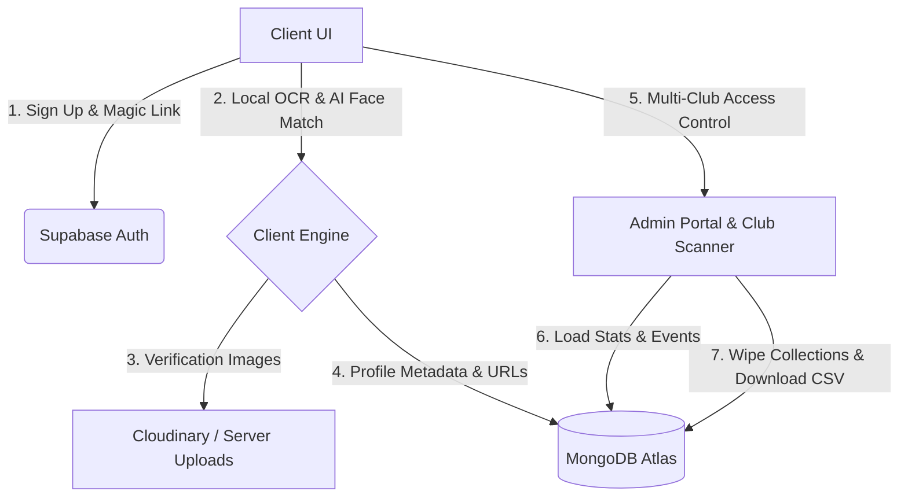

# 🛡️ AgeVault — Premium Decentralized Age Verification & Gatekeeping System

<div align="center">
  
  
  
  
</div>

---

## 🌟 Overview
**AgeVault** is a state-of-the-art, beautifully crafted age verification and event access control system. It integrates dual-layer local OCR parsing, advanced local AI face-matching, secure QR pass generation, and role-based login capabilities. It was specifically built to serve premium nightlife and entertainment venues requiring strict 18+ gatekeeping verification with zero-friction entry.

The system is fully tenanted and optimized for 5 of the most exclusive clubs:
1. **The Palace Lounge**
2. **Hype Nightclub**
3. **Mirage Club & Garden**
4. **Decibel Arena**
5. **Vibe Superclub**

Admins can toggle views dynamically, managing audits, manual CRUD controls, event scheduling, and database hygiene separately for each location or globally.

---

## 🛠️ The Architecture & Technology Stack

AgeVault employs a robust, modern monorepo layout separating frontend and backend operations cleanly:

*   **Frontend UI/UX**:
    *   **Vite + React**: Premium high-performance Single Page Application (SPA).
    *   **Tailwind CSS + Vanilla Custom Glassmorphic Layers**: Seamless transition animations, glowing card borders, custom typewriter effects, and dynamic light/dark theme switching.
    *   **Client-Side AI/ML**:
        *   `@vladmandic/face-api`: In-browser facial detection and landmark matching (lowered to an optimized **40% sensitivity threshold** to prevent false rejections).
        *   `tesseract.js`: High-accuracy optical character recognition (OCR) running locally in the user's browser to parse identity document Dates of Birth.
    *   **Security & Auth**: Supabase Auth integration for secure credentials, metadata tracking, and magic-link authorization.

*   **Backend Services**:
    *   **Express & Node.js**: Highly organized MVC REST API.
    *   **Resend Integration**: Sends beautifully-styled, security verification codes (OTP) straight to email inboxes for secure auth validation.
    *   **Storage Adapters**: Hybrid Cloudinary adapter for media upload & local compressed buffer engines.
    *   **Mongoose ODM**: Handles database access, model validation, and daily data-hygiene routines.

---

## 💾 Data Locations Guide — Which Database Has What Data?

To help you monitor and verify database details, here is a step-by-step architectural breakdown of where user, auth, and image data is stored:

### 1. 🟢 Supabase Auth Database (Decentralized Auth)
*   **What is stored here**: User registration credentials, unique user identifiers (`UID`), signup metadata, and active JWT session tokens.
*   **Data details**:
    *   Supabase handles all secure authentication. When a user requests a magic link or creates a credentials account, it is logged and stored securely within Supabase's managed Postgres server.
    *   Your local app references this using the `supabase.auth` client library to verify identity tokens, extract basic user attributes (`email`), and manage login sessions.
*   **How to view it**: Access your project dashboard at [supabase.com](https://supabase.com). Under the **Authentication** tab, you will see a list of users, their signup times, last sign-in dates, and their unique IDs.

### 2. 🟤 MongoDB Atlas (Application Database)
*   **What is stored here**: Full user profiles, role-based records, event schedules, check-in logs, and verification metadata.
*   **Data details**:
    *   `users` collection: Stores user details mapped to their phone numbers, full names, calculated ages, parsed Dates of Birth (`dob`), active gate permissions (`role`: `'user'`, `'club'`, `'admin'`), audit statuses (`status`: `'pending'`, `'verified'`, `'rejected'`), assigned location (`club`), AI likeness match scores, and scan history.
    *   `events` collection: Stores details of hosted events (`title`, `dateTime`, `venue`, `description`, `club`). To save space, past event descriptions are automatically compressed.
    *   `otps` collection: Stores temporary 6-digit OTP codes and their expiration timestamps (10-minute expiry window) to authorize email checkins.
*   **How to view it**: Access your database at [mongodb.com/atlas](https://mongodb.com/atlas). Open the **Database** cluster, click **Browse Collections**, and inspect the `users` and `events` documents.

### 3. ☁️ Cloudinary & Local Storage (Media Storage)
*   **What is stored here**: Uploaded Aadhaar, passport, or driver's license ID documents, and the captured live selfie screening photos.
*   **Data details**:
    *   To keep the MongoDB Atlas Free Tier database storage footprint lightweight, large images are **never** stored inside MongoDB.
    *   Instead, images are uploaded directly to **Cloudinary** (or saved in a compressed format inside the `/uploads` directory on the server).
    *   Only the secure, public HTTPS image URL strings (e.g., `idCardUrl` and `selfieUrl`) are saved inside the user's MongoDB profile.
*   **How to view it**: Log in to your Cloudinary dashboard at [cloudinary.com](https://cloudinary.com) to view, organize, or delete the verified ID documents and selfies under your Media Library folders.

### 4. 💻 Client Browser Local Storage
*   **What is stored here**: Local session state and styling preferences.
*   **Data details**:
    *   `agevault_token`: The JWT session authorization token used to sign request headers sent to the backend.
    *   `agevault_theme`: Active visual context (`'dark'` or `'light'`), enabling instant aesthetic toggle persistence across reloads.
*   **How to view it**: Press `F12` in your browser to open DevTools, select **Application**, and look under **Local Storage**.

---

## 📈 System Data Flow Diagram



---

## 🎨 Premium UI Aesthetics & Theme Switching

AgeVault features a premium **Glassmorphism Design System** with visual enhancements for both themes:
*   **Dark Mode**: Sleek obsidian canvas (`#090d16`), deep neon-indigo glows, frosted glass cards, and highly-stylized translucent inputs.
*   **Light Mode (Enhanced Contrast)**: Solid, high-contrast, frosted panels (`rgba(255, 255, 255, 0.88)`), clear border definitions (`rgba(79, 70, 229, 0.28)`), and slate-900 typography. This guarantees 100% legibility in bright environments while keeping the premium glassmorphic feel.
*   **Animations**: Elegant fading transitions, scale-up modals, scanner lasers, and dynamic custom typewriter text titles.

---

## 🚀 Setup & Installation Guide

Follow these steps to spin up the entire application locally:

### 1. Prerequisites
Ensure you have node.js (v16+) installed. Clone the repository and run:
```bash
npm run install-all
```
This runs parallel package installations inside both the `frontend` and `backend` directories.

### 2. Model Weights Setup
The client-side AI face recognition requires pre-trained model weights. Download them into the public directory by running:
```bash
npm run download-models
```
*This downloads the required SSD MobileNet, Face Landmark, and Face Recognition weights to `frontend/public/models` automatically.*

### 3. Environment Variables Config
Create configuration files for the database connections:

*   **Backend (`backend/.env`)**:
    ```env
    PORT=5000
    MONGO_URI=mongodb+srv://<username>:<password>@cluster.mongodb.net/agevault
    JWT_SECRET=your_jwt_signing_key_secret_key
    CLOUDINARY_CLOUD_NAME=your_cloudinary_cloud_name
    CLOUDINARY_API_KEY=your_cloudinary_api_key
    CLOUDINARY_API_SECRET=your_cloudinary_api_secret
    RESEND_API_KEY=re_bSHxQUsB_B51eoYCJbQb5aGX4MYLXBTDg
    ```

*   **Frontend (`frontend/.env`)**:
    ```env
    VITE_API_URL=http://localhost:5000
    VITE_SUPABASE_URL=https://your-supabase-project-url.supabase.co
    VITE_SUPABASE_ANON_KEY=your_supabase_anon_public_key
    ```

### 4. Run Development Servers
Start both servers simultaneously to test local changes:
*   **Backend**: `cd backend && npm run dev` (Runs on port `5000`)
*   **Frontend**: `cd frontend && npm run dev` (Runs on port `5173`)

### 5. Production Compilation
Verify code compilation and build bundle outputs using Vite:
```bash
npm run build-all
```
This will compile and package static assets into `frontend/dist` without warnings.

---

## 🧹 Maintenance & Storage Protection
To ensure your database stays safely within MongoDB Atlas free tier capacities, follow this simple maintenance workflow inside the **Admin Portal > Database Operations**:
1.  Filter to your club or select **All 5 Clubs**.
2.  Click **1. Download CSV Export** to save the active log records to your offsite Excel sheet.
3.  Once the download completes, the delete mechanism automatically unlocks. Click **2. Clear User Database** to safely wipe user profiles while leaving gatekeeper and system admin accounts intact.

---

<div align="center">
  <sub>Developed with 🤍 for secure gatekeeping and premium venue access control.</sub>
</div>
